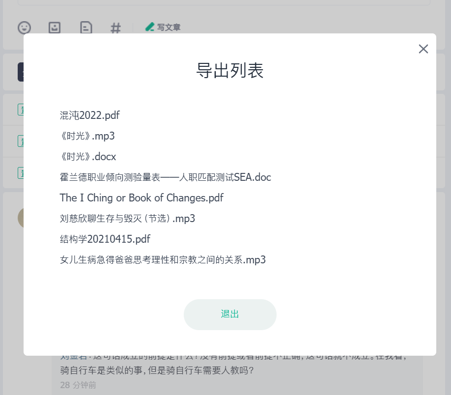
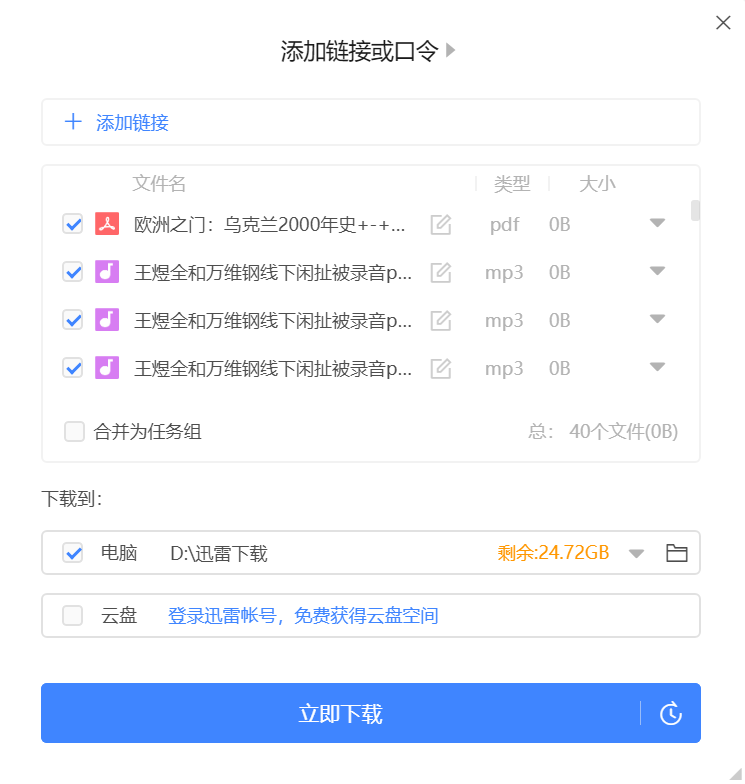

# 星球伴侣

一款强大的知识星球效率工具，帮助你更好地通过知识星球学习

## 安装
- [Chrome 插件商店](https://chrome.google.com/webstore/detail/ffeogmimffjmffnmchbmfofacgpadhpe)  
- [Edge 插件商店](https://microsoftedge.microsoft.com/addons/detail/hnfachcfgmcnmalfpoikfinalngdmgpc)  
- 手动安装：从 [https://extension.wyym.cc](https://extension.wyym.cc) 下载最新版本插件安装包进行安装

## 功能
- [x] 批量下载知识星球文件
- [x] 按照日期筛选文件
- [x] 导出下载链接 (可以用迅雷或者其它的下载器下载)

## 联系
官网 [https://extension.wyym.cc](https://extension.wyym.cc)

## 教程：如何批量下载知识星球的文件

安装完之后打开知识星球，页面右下角出现了一个悬浮按钮，点击悬浮按钮，可以看到菜单栏有下载文件和导出下载链接的功能。

点击“导出下载链接”，可以一键导出全部文件的下载链接，也可以按照时间筛选文件，导出完成后会下载一个 `.txt` 文件，里面是就是知识星球文件的下载链接。

最后打开迅雷，点击“新建”，把刚才导出的链接粘贴进去，很快 3000 个文件就下载好了。

如果不想用下载器下载，可以直接点击“下载文件”，插件会直接通过浏览器下载文件。

